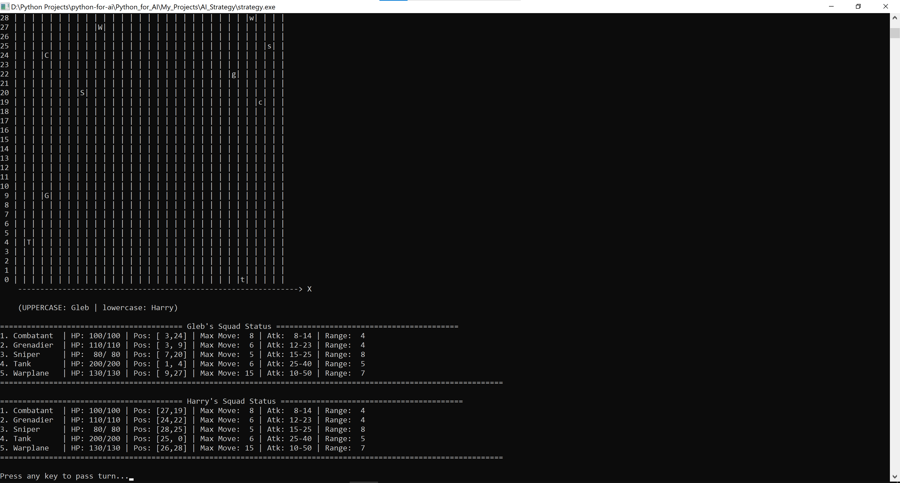
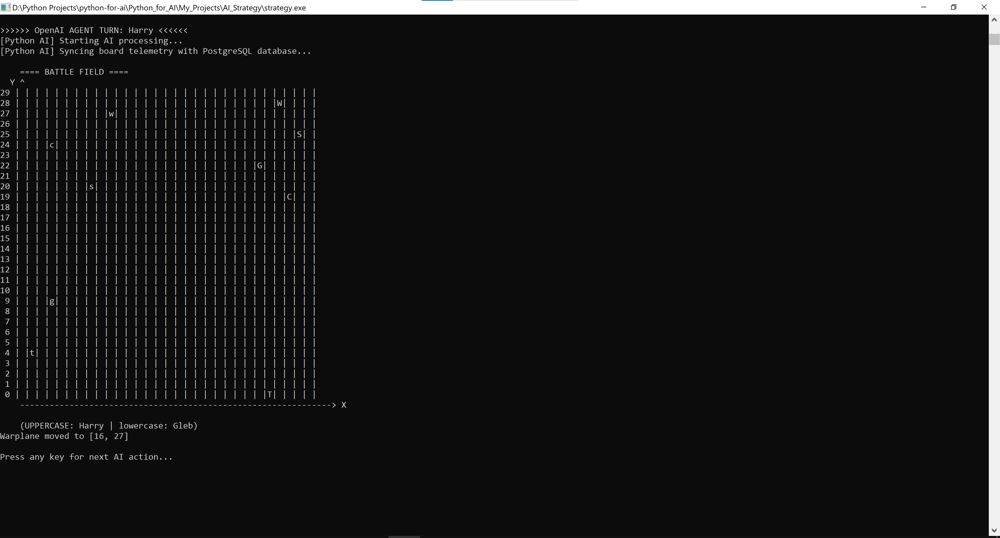
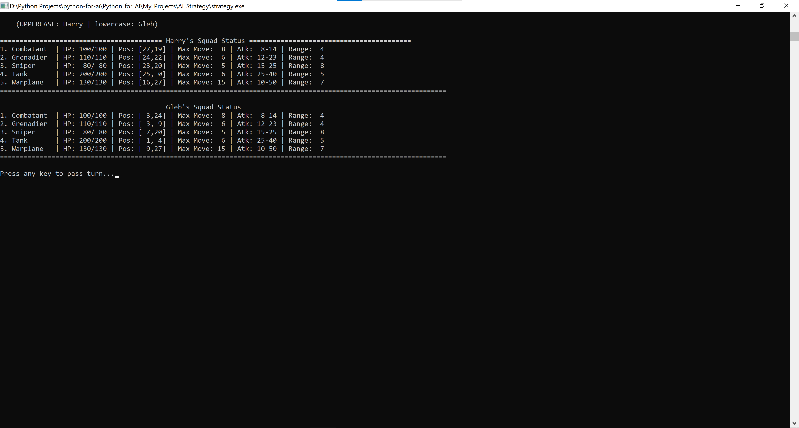
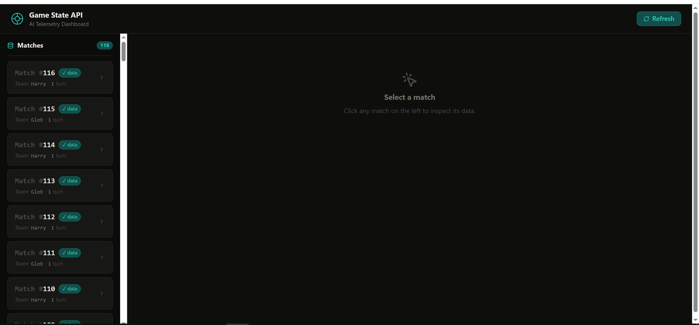
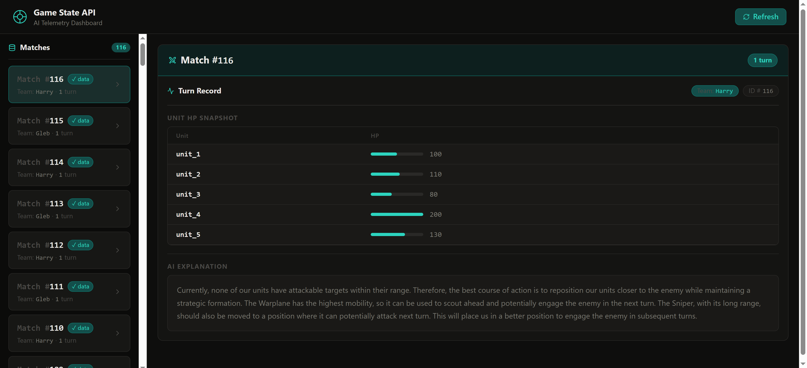
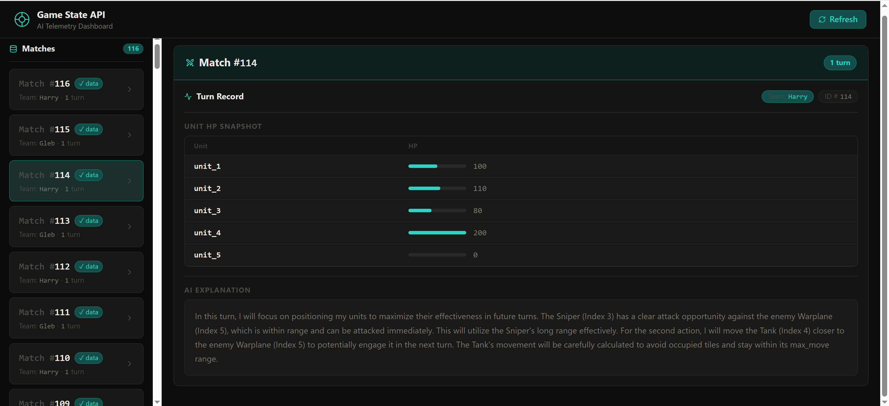

# AI Strategy Game – C++ + FastAPI + OpenAI

Turn-based 2D strategy game where a C++ engine simulates combat between two squads on a grid-based battlefield, while an external OpenAI agent (via Python + FastAPI) can control one or both teams. The project showcases modern C++ techniques (ranges, optional, filesystem, <random>) and integration with a Python web backend and React-like frontend (Reflex).

---

## Table of Contents

- [Overview](#overview)
- [Screenshots](#screenshots)
- [Key Features](#key-features)
- [Architecture](#architecture)
- [Core C++ Design](#core-c-design)
- [Modern C++ Techniques Used](#modern-c-techniques-used)
- [How to Run](#how-to-run)
- [Possible Extensions](#possible-extensions)

---

## Overview

This project is a small but complete strategy game engine written in C++ that:

- Simulates two opposing squads (Player A and Player B) on a 2D grid.
- Supports three modes: Human vs AI, AI vs AI, and Human vs Human.
- Uses a Python-based OpenAI agent to decide AI actions based on a JSON game state description.
- Exposes game state to a FastAPI backend and visualizes it with a Reflex (Python+React-style) frontend.

The focus is on **clean C++ design**, **modern language features**, and **practical AI integration**, not on graphics.

---

## Screenshots

### Battlefield View


### Alternative Angles



### Web Dashboard – Turn History


### Additional Views




## Key Features

### Gameplay

- Grid-based 2D battlefield with configurable width/height (`Config` namespace).
- Multiple unit types (`UnitType` enum): Soldier (Combatant), Grenadier, Sniper, Tank, Helicopter (Warplane), each with different:
  - Max HP
  - Movement range
  - Damage range
  - Attack range
- Turn-based combat:
  - Each turn consists of exactly **two actions**.
  - Normally, actions must be assigned to two different units.
  - Exception: if a player has only one living unit, both actions may go to that unit.
- Coordinate system:
  - X from 0 to `MAP_WIDTH - 1` (left to right).
  - Y from 0 to `MAP_HEIGHT - 1` (bottom to top).
  - Movement and attack use **Chebyshev distance** `max(|dx|, |dy|)`.

### Game Modes

- **Human vs AI**: Human controls Player 1 via console; OpenAI agent controls Player 2.
- **AI vs AI**: Both sides controlled by the OpenAI agent; C++ engine enforces rules.
- **Human vs Human**: Both players interact via console UI.

---

## Architecture

The project consists of three main layers:

1. **C++ Core Engine**
   - Files: `strategy.cpp`, `Unit.*`, `Player.*`, `Utils.*`, `AI.*`, `Config.*`
   - Responsibilities:
     - Manage units, players, turns, rules.
     - Serialize game state to JSON.
     - Validate and apply actions from humans and AI.

2. **Python Backend (FastAPI)**
   - Exposes API endpoints (e.g. `/turns`, `/turn/{match_id}`) to view game history.
   - Persists turns to a database.

3. **Python Frontend (Reflex)**
   - React-style UI that consumes FastAPI endpoints.
   - Displays turn history, unit positions, and game progression.

4. **OpenAI Integration**
   - C++ writes `game_config.json` (rules + unit stats) and `game_state.json` (current state).
   - Python script `openai_parsing.py` reads `game_state.json`, calls the OpenAI API, and writes `ai_action.json`.
   - C++ reads `ai_action.json`, parses it into structured `ParsedAction` objects, validates, and applies them.

`strategy.cpp` orchestrates everything: launches FastAPI, launches the Reflex dev server, opens the browser, and then runs the C++ game loop.

---

## Core C++ Design

### Main Entities

- **Unit**
  - Represents a single combat unit on the battlefield.
  - Fields:
    - `typeName`, `symbol`
    - `health`, `maxHealth`
    - `positionX`, `positionY`
    - `maxMovement`
    - `minAttack`, `maxAttack`
    - `attackRange`
    - `alive` flag
  - Methods:
    - `Move(dx, dy)` – checks movement range, clamps to map bounds, prints result.
    - `Attack(Unit& opponent)` – checks range and applies random damage using `std::mt19937`.
    - `TakeDamage(int damage)` – reduces HP and sets `alive = false` at 0 HP.
    - Getter methods for all state.

- **Player**
  - Owns a `std::vector<Unit>` squad and a name + team identifier (`'A'` / `'B'`).
  - Methods:
    - `AddUnit(UnitType type, int x, int y)` – spawns new units.
    - `hasLivingUnits()` – checks if any unit is alive (`std::ranges::any_of`).
    - `getLivingUnitCount()` – counts alive units (`std::ranges::count_if`).
    - `DisplaySquadStatus()` – prints a nicely formatted table of all units.

- **Utils (namespace)**
  - Console and gameplay helpers:
    - `GetValidInteger()` – robust integer input using `std::numeric_limits`.
    - `ClearScreen()` – clears console with ANSI escape codes.
    - `ConfigureConsole()` – maximizes console window (WinAPI).
    - `IsTileOccupied(x, y, Player& p1, Player& p2)` – checks if any alive unit is on that tile using `std::ranges::any_of` + lambdas.
    - `DrawMap(Player&, Player&)` – draws battlefield grid using `std::views::iota`, `std::views::reverse`, and `std::optional<char>`.
    - `ExecuteUnitAction(Unit&, Player&, Player&)` – lets a human move or attack with a single unit.
    - `GetUnitsInAttackRange` / `GetAttackableEnemyIndices` – compute which enemies are in range (0-based vs 1-based indices).
    - `PlayTurn(Player& active, Player& enemy)` – executes exactly two actions for the active player.

- **AI**
  - High-level interface used by `strategy.cpp`.
  - Methods:
    - `InitializeOpenAIEngine()` – writes `game_config.json` (map size, unit stats, rules).
    - `CallOpenAIEngine(Player& ai, Player& enemy, int turnNum, int lastUnitIdx)` – writes `game_state.json` and runs `openai_parsing.py`.
    - `PlayOpenAITurn(Player& ai, Player& enemy, int turnNum)` – reads `ai_action.json`, parses actions, validates and applies them.

---

## Modern C++ Techniques Used

This project deliberately uses a set of modern C++ features and standard library components:

### Language and OOP

- Strongly-typed `enum class UnitType` for unit archetypes.
- Encapsulation via private members and public getters/setters.
- Constructors for consistent initialization of `Unit` and `Player` objects.
- Clear separation of responsibilities across modules (`Unit`, `Player`, `AI`, `Utils`, `Config`).

### STL Containers, Ranges, Algorithms

- `std::vector<Unit>` to store squads with automatic memory management.
- `std::ranges::any_of` / `std::ranges::count_if` to query squads for living units.
- `std::views::iota` + `std::views::reverse` for clean index iteration and reversed loops (e.g. drawing the map from top to bottom).
- Range-based `for` loops for clarity and safety over units and actions.

### Robust Input and Boundaries

- `GetValidInteger()` uses `std::numeric_limits<std::streamsize>::max()` to safely flush invalid characters from `std::cin`.
- `std::clamp` keeps unit coordinates inside `[0, MAP_WIDTH-1]` and `[0, MAP_HEIGHT-1]` during movement and input processing.

### Random Number Generation

- `static thread_local std::mt19937 generator(std::random_device{}());` for thread-safe, modern PRNG.
- `std::uniform_int_distribution<int>` for damage between `minAttack` and `maxAttack`.
- Classic `rand()` / `srand(time(0))` used only for initial spawn randomness (simple, non-critical randomness).

### Optional and Filesystem

- `std::optional<int>` for `ParsedAction::targetIndex` so that move actions can omit a target while attack actions include one.
- `std::optional<char>` in `DrawMap` to represent “no unit” vs “unit present” in each cell.
- `std::filesystem::exists("ai_action.json")` to safely check for AI output before reading.

### JSON Serialization / Parsing

- C++ writes `game_config.json` and `game_state.json` using `std::ofstream` and string streaming.
- AI actions are parsed from `ai_action.json` with a custom parser:
  - Manual `std::string::find` for `"unit_index"`, `"action_type"`, `"dx"`, `"dy"`, `"target_index"`.
  - 1-based indices from JSON are converted to 0-based indices for `std::vector` access.
- Parsed actions are represented as a dedicated `struct ParsedAction { ... }`.

---

## How to Run

> **Note:** Commands and paths here are an example. Adjust paths to match your environment.

1. **Start the C++ launcher**

   The C++ `main` in `strategy.cpp` will:
   - Start FastAPI backend with:
     ```bash
     uv run uvicorn main:app --reload
     ```
   - Start Reflex frontend with:
     ```bash
     uv run reflex run
     ```
   - Open `http://localhost:3000` in your browser.
   - Then begin the console game.

   Build and run your C++ project (e.g., using CMake or your IDE). When it runs, it will orchestrate the backend/frontend startup.

2. **Select game mode**

   In the console:

   - Choose `1` (Human vs AI), `2` (AI vs AI), or `3` (Human vs Human).
   - Enter player names as requested.

3. **Play**

   - Use the console prompts to:
     - Select units.
     - Choose `Move` or `Attack`.
     - Enter relative movement (`dx`, `dy`) or choose target indices.
   - Watch the battlefield update in the console and track game state/turns in the web UI.


---